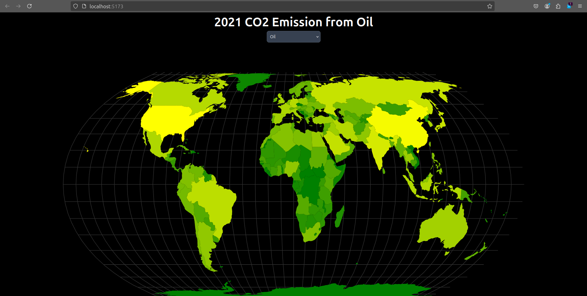
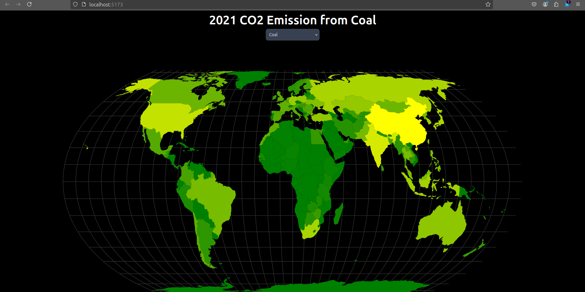

# Country Statistics

Label each countries based on  different numerical values like CO2 Emission, Population Rate, and all statistical related

## Emission of Oil during 2021
> Green means non to low CO2 emission to yellow for moderate to high emission

## Emission of Coal during 2021

